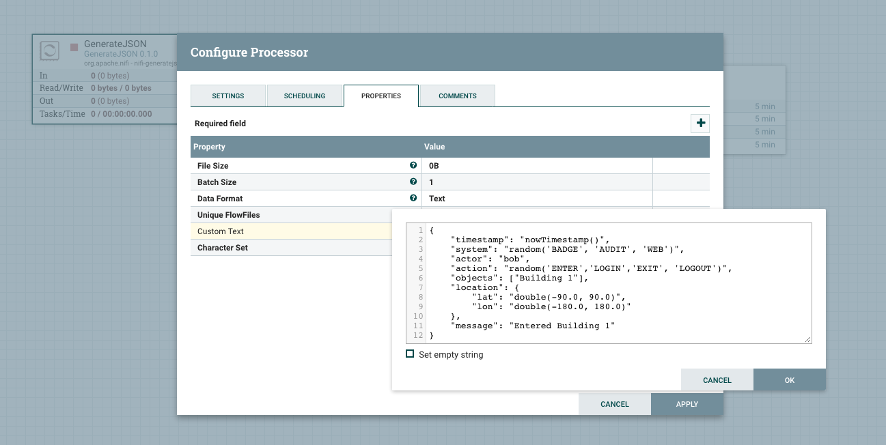
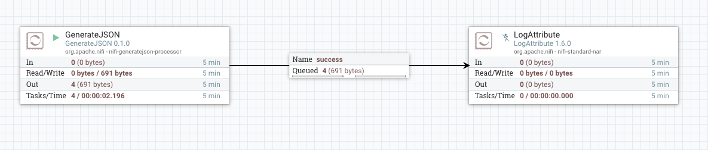
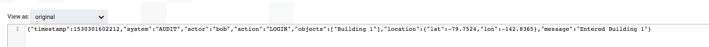
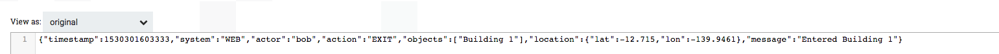

# nifi-generatejson-processor
A NiFi processor to generate JSON based on json-data-generator java library (https://github.com/acesinc/json-data-generator). 

## Installation :

1. Download the nar file from github release tab and drop it in the NiFi lib folder $NIFIROOT/lib/
2. Restart NiFi to load the new processor

## Usage

1. Drag and drop the "GenerateJSON" processor into the NiFi Canvas

2. Configure the processor and add following text to the "Custom Text" attribute. You can leave other attributes as is

    Note: This is a sample template. plz refer to "Workflow Steps" section here in https://github.com/acesinc/json-data-generator for more details
    
    
    {
        "timestamp": "nowTimestamp()",
        "system": "random('BADGE', 'AUDIT', 'WEB')",
        "actor": "bob",
        "action": "random('ENTER','LOGIN','EXIT', 'LOGOUT')",
        "objects": ["Building 1"],
        "location": {
            "lat": "double(-90.0, 90.0)",
            "lon": "double(-180.0, 180.0)"
        },
        "message": "Entered Building 1"
    }

3. Run the Flow

4. Review the flow files

    Notice the random values generated for the system based on the inputs and differences

Flow File 1

Flow File 2

