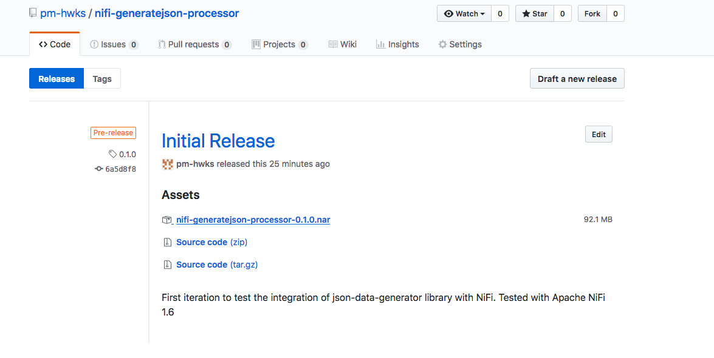

# nifi-generatejson-processor
A NiFi processor to generate JSON based on json-data-generator java library (https://github.com/acesinc/json-data-generator). 

## Installation :

Download the nar file from github release tab and drop it in the NiFi lib folder $NIFIROOT/lib/

